# D-Auth Complete Architecture with Hooks Flow

This diagram shows the complete d-auth architecture including configuration, storage, middleware, guards, and **all hook triggers**.

```mermaid
graph TB
    %% Configuration Layer
    subgraph CONFIG["⚙️ Configuration Layer"]
        USER_CONFIG["DAuthOptions<br/>• strategy: jwt/session<br/>• database: IDatabaseAdapter<br/>• sessionStore: ISessionStore<br/>• jwt/session config<br/>• hooks, oauth, security"]

        HOOKS["🎣 DAuthHooks<br/>✅ onUserRegistered<br/>✅ onUserLogin<br/>✅ onUserLogout<br/>✅ onUserCreatedWithTempPassword<br/>✅ onPasswordReset<br/>✅ onOTPGenerated<br/>✅ onAccountLocked<br/>⏳ on2FAEnabled<br/>⏳ on2FADisabled"]

        USER_CONFIG --> HOOKS
    end

    %% Storage Layer
    subgraph STORAGE["💾 Storage Layer"]
        DB_ADAPTER["IDatabaseAdapter<br/>• findUserById/Email<br/>• createUser, updateUser<br/>• createSession, deleteSession<br/>• createOTP, verifyOTP<br/>• isAccountLocked, lockAccount"]

        SESSION_STORE["ISessionStore<br/>• createSession<br/>• getSession<br/>• deleteSession<br/>• deleteAllUserSessions"]

        STORE_TYPES["Store Options:<br/>• MemorySessionStore (dev)<br/>• RedisSessionStore (prod)<br/>• DatabaseSessionStore (default)"]

        SESSION_STORE -.-> STORE_TYPES
    end

    %% Core DAuth Class
    subgraph CORE["🏛️ Core - DAuth.ts"]
        DAUTH["DAuth Class<br/>• Validates config<br/>• Initializes middleware<br/>• Initializes guards<br/>• Exposes public API"]
    end

    %% Middleware Layer with Hook Triggers
    subgraph MIDDLEWARE["🔧 Middleware Layer - Hook Triggers"]
        REGISTER_MW["RegisterMiddleware<br/>• validate input<br/>• hash password<br/>• create user<br/>🎣 onUserRegistered"]

        LOGIN_MW["LoginMiddleware<br/>• validate credentials<br/>• check lockout<br/>• track failed attempts<br/>🎣 onUserLogin<br/>🎣 onAccountLocked"]

        LOGOUT_MW["LogoutMiddleware<br/>• clear cookies<br/>• invalidate session<br/>🎣 onUserLogout"]

        OAUTH_MW["OAuthMiddleware<br/>• Google/Facebook/Apple<br/>• OAuth callbacks<br/>🎣 onUserRegistered<br/>🎣 onUserLogin"]

        ADMIN_MW["AdminCreateUserMiddleware<br/>• generate temp password<br/>• force password reset<br/>🎣 onUserCreatedWithTempPassword<br/>🎣 onPasswordReset"]

        RESET_MW["PasswordResetMiddleware<br/>• generate OTP<br/>• verify OTP<br/>• update password<br/>🎣 onOTPGenerated<br/>🎣 onPasswordReset"]

        REFRESH_MW["RefreshTokenMiddleware<br/>• verify refresh token<br/>• rotate tokens<br/>• update session"]
    end

    %% Guards Layer
    subgraph GUARDS["🛡️ Guards Layer"]
        REQUIRE_AUTH["requireAuth()<br/>• Extract token (cookie/header)<br/>• Verify JWT/Session<br/>• Check blacklist (if enabled)<br/>• Attach user to req"]

        REQUIRE_ROLES["requireRoles(roles)<br/>• Check user.roles<br/>• Role hierarchy support<br/>• ANY role match"]

        REQUIRE_ALL["requireAllRoles(roles)<br/>• Require ALL roles<br/>• Hierarchy support"]
    end

    %% Hook Flow Details
    subgraph HOOK_FLOWS["🎣 Hook Execution Flows"]
        REGISTRATION_HOOKS["Registration Flow:<br/>1. User submits form<br/>2. RegisterMiddleware validates<br/>3. User created in DB<br/>4. 🎣 onUserRegistered fires<br/>5. Send welcome email"]

        LOGIN_HOOKS["Login Flow:<br/>1. User submits credentials<br/>2. LoginMiddleware validates<br/>3. Check failed attempts<br/>4a. Success → 🎣 onUserLogin<br/>4b. Lockout → 🎣 onAccountLocked<br/>5. Send notifications"]

        LOGOUT_HOOKS["Logout Flow:<br/>1. User requests logout<br/>2. LogoutMiddleware invalidates<br/>3. 🎣 onUserLogout fires<br/>4. Clear cache/sessions"]

        ADMIN_HOOKS["Admin Create Flow:<br/>1. Admin creates user<br/>2. Generate temp password<br/>3. 🎣 onUserCreatedWithTempPassword<br/>4. Send welcome email with temp pwd<br/>5. User resets password<br/>6. 🎣 onPasswordReset fires"]

        RESET_HOOKS["Password Reset Flow:<br/>1. User requests reset<br/>2. 🎣 onOTPGenerated fires<br/>3. Send OTP email<br/>4. User verifies OTP<br/>5. Password updated<br/>6. 🎣 onPasswordReset fires<br/>7. Send confirmation"]

        OAUTH_HOOKS["OAuth Flow:<br/>1. User clicks 'Login with X'<br/>2. OAuth callback<br/>3a. New user → 🎣 onUserRegistered<br/>3b. Existing user → 🎣 onUserLogin<br/>4. Send notifications"]
    end

    %% Validation & Security
    subgraph SECURITY["✅ Validation & Security"]
        VALIDATIONS["Input Validation<br/>• Zod schemas<br/>• Email format<br/>• Password strength<br/>• SQL injection prevention"]

        SECURITY_CHECKS["Security Features<br/>• Account lockout (5 attempts)<br/>• Password hashing (bcrypt)<br/>• JWT blacklist strategy<br/>• Session management<br/>• CSRF protection"]
    end

    %% Utilities
    subgraph UTILS["🔧 Utilities"]
        TOKEN_UTILS["Token Management<br/>• generateAccessToken()<br/>• generateRefreshToken()<br/>• verifyToken()<br/>• JWT.sign/verify"]

        PASSWORD_UTILS["Password Utilities<br/>• bcrypt.hash()<br/>• bcrypt.compare()<br/>• Generate temp password"]

        CLIENT_UTILS["Client Details<br/>• extractClientDetails()<br/>• IP address<br/>• User-Agent parsing"]
    end

    %% Public API
    subgraph API["📡 Public API - index.v4.ts"]
        EXPORTS["Module Exports<br/>• DAuth<br/>• IDatabaseAdapter<br/>• ISessionStore<br/>• requireAuth<br/>• requireRoles<br/>• All middleware<br/>• All types"]
    end

    %% Real-world Hook Usage Example
    subgraph EXAMPLE["💡 Hook Usage Example"]
        HOOK_IMPL["hooks: {<br/>  onUserCreatedWithTempPassword: async (data) => {<br/>    await emailService.sendWelcome({<br/>      to: data.email,<br/>      tempPassword: data.temporaryPassword,<br/>      user: data.user<br/>    });<br/>  },<br/>  onUserLogin: async (data) => {<br/>    await auditLog.create({<br/>      userId: data.user.id,<br/>      ip: data.ip,<br/>      device: data.deviceName<br/>    });<br/>  },<br/>  onAccountLocked: async (data) => {<br/>    await emailService.sendSecurityAlert({<br/>      to: data.user.email,<br/>      lockedUntil: data.lockedUntil<br/>    });<br/>  }<br/>}"]
    end

    %% Connections
    USER_CONFIG ==> DAUTH
    HOOKS ==> DAUTH
    DB_ADAPTER ==> DAUTH
    SESSION_STORE ==> DAUTH

    DAUTH ==> MIDDLEWARE
    DAUTH ==> GUARDS

    MIDDLEWARE -.-> DB_ADAPTER
    MIDDLEWARE -.-> SESSION_STORE
    MIDDLEWARE -.-> UTILS
    MIDDLEWARE -.-> VALIDATIONS
    MIDDLEWARE ==> HOOKS

    GUARDS -.-> DB_ADAPTER
    GUARDS -.-> SESSION_STORE
    GUARDS -.-> TOKEN_UTILS

    HOOKS --> HOOK_FLOWS
    HOOK_FLOWS --> EXAMPLE

    REGISTER_MW --> REGISTRATION_HOOKS
    LOGIN_MW --> LOGIN_HOOKS
    LOGOUT_MW --> LOGOUT_HOOKS
    ADMIN_MW --> ADMIN_HOOKS
    RESET_MW --> RESET_HOOKS
    OAUTH_MW --> OAUTH_HOOKS

    VALIDATIONS --> SECURITY_CHECKS

    DAUTH ==> API

    %% Styling
    classDef configClass fill:#e1f5ff,stroke:#01579b,stroke-width:2px
    classDef storageClass fill:#fff3e0,stroke:#e65100,stroke-width:2px
    classDef coreClass fill:#f3e5f5,stroke:#4a148c,stroke-width:3px
    classDef middlewareClass fill:#e8f5e9,stroke:#1b5e20,stroke-width:2px
    classDef guardClass fill:#fce4ec,stroke:#880e4f,stroke-width:2px
    classDef hookClass fill:#fff9c4,stroke:#f57f17,stroke-width:3px
    classDef utilClass fill:#e0f2f1,stroke:#004d40,stroke-width:2px
    classDef apiClass fill:#fce4ec,stroke:#880e4f,stroke-width:2px

    class CONFIG,USER_CONFIG configClass
    class HOOKS,HOOK_FLOWS,REGISTRATION_HOOKS,LOGIN_HOOKS,LOGOUT_HOOKS,ADMIN_HOOKS,RESET_HOOKS,OAUTH_HOOKS,EXAMPLE,HOOK_IMPL hookClass
    class STORAGE,DB_ADAPTER,SESSION_STORE,STORE_TYPES storageClass
    class CORE,DAUTH coreClass
    class MIDDLEWARE,REGISTER_MW,LOGIN_MW,LOGOUT_MW,OAUTH_MW,ADMIN_MW,RESET_MW,REFRESH_MW middlewareClass
    class GUARDS,REQUIRE_AUTH,REQUIRE_ROLES,REQUIRE_ALL guardClass
    class UTILS,TOKEN_UTILS,PASSWORD_UTILS,CLIENT_UTILS,SECURITY,VALIDATIONS,SECURITY_CHECKS utilClass
    class API,EXPORTS apiClass
```



## 📊 Hook Trigger Summary

| Middleware | Hooks Fired | When |
|------------|-------------|------|
| **RegisterMiddleware** | `onUserRegistered` | After user successfully registered |
| **LoginMiddleware** | `onUserLogin`<br>`onAccountLocked` | On successful login<br>When account locked after failed attempts |
| **LogoutMiddleware** | `onUserLogout` | On successful logout |
| **OAuthMiddleware** | `onUserRegistered`<br>`onUserLogin` | New OAuth user created<br>Existing OAuth user login |
| **AdminCreateUserMiddleware** | `onUserCreatedWithTempPassword`<br>`onPasswordReset` | Admin creates user with temp password<br>User completes forced password reset |
| **PasswordResetMiddleware** | `onOTPGenerated`<br>`onPasswordReset` | OTP generated for password reset<br>Password successfully reset |

## 🔄 Complete Request Flow Example

### Login Request Flow:
```
1. POST /auth/login
   ↓
2. LoginMiddleware.login()
   ↓
3. Validate credentials (userValidations.loginValidation)
   ↓
4. database.findUserByEmail()
   ↓
5. Check account lockout (database.isAccountLocked())
   ↓
6. Verify password (bcrypt.compare())
   ↓
7a. FAIL → Increment failed attempts
    ↓
    Check if >= maxFailedLoginAttempts
    ↓
    database.lockAccount()
    ↓
    🎣 hooks.onAccountLocked() → Send security alert email
    ↓
    Return 403 Account Locked

7b. SUCCESS → Reset failed attempts
    ↓
    generateTokens()
    ↓
    sessionStore.addSession()
    ↓
    🎣 hooks.onUserLogin() → Send login notification, log audit
    ↓
    setTokenCookies()
    ↓
    Return 200 with tokens
```

### Admin Create User Flow:
```
1. POST /auth/admin/create-user
   ↓
2. AdminCreateUserMiddleware.adminCreateUser()
   ↓
3. Validate input
   ↓
4. Generate temporary password
   ↓
5. Hash password (bcrypt.hash())
   ↓
6. database.createUser({ mustResetPassword: true })
   ↓
7. 🎣 hooks.onUserCreatedWithTempPassword()
   ↓
   Send welcome email with temporary password
   ↓
   Example:
   emailService.sendWelcome({
     to: user.email,
     temporaryPassword: "TempPass123!",
     user: { id, email, firstName }
   })
   ↓
8. Return 201 Created

Later when user resets password:
   ↓
9. POST /auth/force-password-reset
   ↓
10. Verify old password + set new password
    ↓
11. database.updatePassword()
    ↓
12. 🎣 hooks.onPasswordReset()
    ↓
    Send password reset confirmation
    ↓
13. Return 200 Success
```

## 🎯 Key Architectural Decisions

1. **Hook Placement**: Hooks fire AFTER successful operations but BEFORE response
2. **Error Handling**: Hook failures should be logged but not break the auth flow
3. **Async Support**: All hooks support async/await for database/email operations
4. **Data Minimization**: Hooks receive only necessary user data (no passwords)
5. **Flexibility**: Hooks are optional - system works without any hooks configured

## ✅ Implementation Checklist

- [x] `onUserRegistered` - Register & OAuth flows
- [x] `onUserLogin` - Login & OAuth flows
- [x] `onUserLogout` - Logout flow
- [x] `onUserCreatedWithTempPassword` - Admin create user flow
- [x] `onPasswordReset` - Password reset & force reset flows
- [x] `onOTPGenerated` - OTP generation flow
- [x] `onAccountLocked` - Account lockout flow
- [ ] `on2FAEnabled` - 2FA setup flow (TODO)
- [ ] `on2FADisabled` - 2FA disable flow (TODO)

## 📚 Related Documentation

- [HOOKS_REFERENCE.md](./HOOKS_REFERENCE.md) - Complete hook documentation
- [src/types/config.ts](./src/types/config.ts) - Type definitions
- [src/middleware/BaseAuthMiddleware.ts](./src/middleware/BaseAuthMiddleware.ts) - Base middleware class
- [V4_USAGE_GUIDE.md](./V4_USAGE_GUIDE.md) - Usage examples
